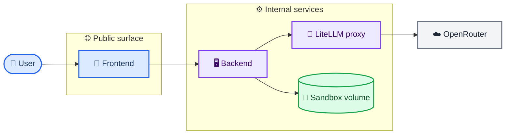
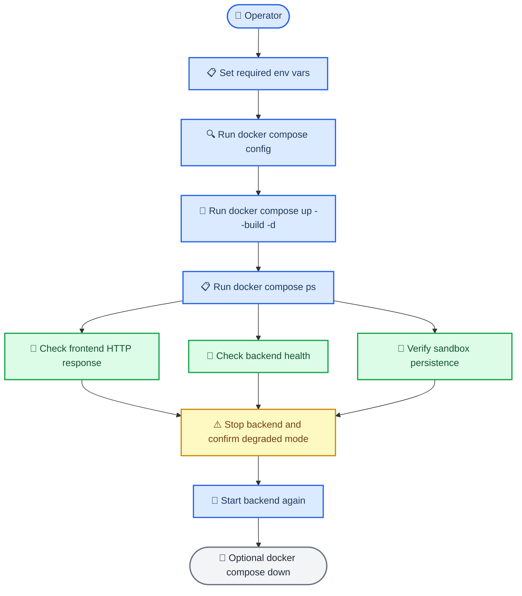
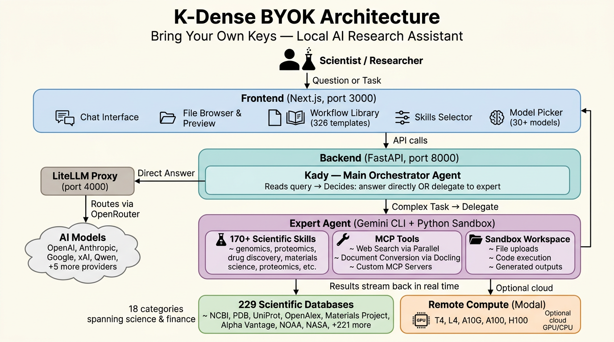

# K-Dense BYOK

**Your own AI research assistant, running on your computer, powered by your API keys.**

K-Dense BYOK (Bring Your Own Keys) is an open-source app that lets you chat with an AI assistant called **Kady**. You ask Kady a question or give it a task, and it figures out the best way to handle it - sometimes answering directly, sometimes spinning up specialized AI "experts" that work behind the scenes to get you a thorough result.

It's built for scientists, analysts, and curious people who want a powerful AI workspace without being locked into a single provider. K-Dense BYOK is powered by our very popular Scientific Agent Skills.

[](https://youtu.be/BVG50mgw6-4?si=pbEUdpuQJJfGiKjw)

> **Beta:** K-Dense BYOK is currently in beta. Many features and performance improvements are on the way in the coming weeks. [Star us on GitHub](https://github.com/K-Dense-AI/k-dense-byok) to stay in the loop, and follow us on [X](https://x.com/k_dense_ai), [LinkedIn](https://www.linkedin.com/company/k-dense-inc), and [YouTube](https://www.youtube.com/@K-Dense-Inc) for release notes and tutorial videos.

## What can it do?

### AI agent and expert delegation

- **Answer questions and complete tasks** - Ask Kady anything. For complex work, it delegates to AI experts that each have their own specialties (bioinformatics, finance, data analysis, etc.) with full access to our 170+ scientific skills.
- **Choose your AI model** - Pick from 30 models across 10 providers (OpenAI, Anthropic, Google, xAI, Qwen, Nvidia, MiniMax, Moonshotai, Bytedance Seed, and Z AI) through a simple dropdown in the app. Switch models per message - you're not stuck with one.
- **Expert delegation system** - When a task requires deep work, Kady delegates to a specialist agent running the Gemini CLI with a full Python environment, scientific skills, and MCP tools in an isolated sandbox. Results stream back in real time with activity indicators showing delegation progress, tools used, and skills activated.
- **Skills passthrough** - Kady knows the full catalogue of installed scientific skills and passes the right ones to the expert for each task. You can also manually select skills from the Skills selector in the input bar.

### Scientific capabilities

- **Access 229 scientific and financial databases** - Browse and attach databases from 18 categories (Biomedical & Health, Chemistry & Materials, Scholarly Publications, Stock Market & Equities, Earth & Climate, Astronomy & Space, and more) spanning science and finance domains. Each database entry links to its API documentation.
- **170+ scientific agent skills** - Pre-loaded from [K-Dense scientific-agent-skills](https://github.com/K-Dense-AI/scientific-agent-skills), covering genomics, proteomics, drug discovery, materials science, and more. Skills are automatically downloaded on first run and available to every expert session.
- **326 ready-to-use workflows** - Browse a built-in library of workflow templates spanning 22 disciplines - from genomics and drug discovery to finance and astrophysics. Pick a workflow, fill in the variables, select a model, and launch. Each workflow comes with curated skill suggestions so the agent knows exactly which tools to reach for. Workflows that need uploaded data are clearly marked, and you can upload files directly from the launch dialog.
- **30+ optional API keys for scientific databases** - Connect to NCBI, Semantic Scholar, CORE, OpenAlex, Materials Project, OMIM, BioGRID, DisGeNET, Addgene, OpenFDA, PatentsView, Data Commons, FRED, BEA, BLS, Census, NASA, NOAA, Alpha Vantage, Zotero, Hugging Face, and more.

### File management and preview

- **Full sandbox file system** - Upload files and folders (drag-and-drop or file picker), create directories, rename, move, delete, and download individual files or entire directories as zip archives. Everything stays local in a `sandbox/` folder on your machine.
- **Rich file preview** - Open files in tabs with intelligent viewers for each format:
  - **Code** - Syntax-highlighted, read-only CodeMirror editor with line numbers and code folding for any text file
  - **Markdown** - Rendered with math (KaTeX), Mermaid diagrams, and code highlighting
  - **CSV** - Parsed and displayed as an interactive table
  - **PDF** - Inline iframe viewer
  - **Images** - Inline preview with an annotation/drawing tool for marking up images
  - **Jupyter notebooks (`.ipynb`)** - Cell-by-cell viewer showing markdown, code, stream output, images, HTML, and tracebacks
  - **Bioinformatics formats** - Dedicated viewers for FASTA/FASTQ sequences and tabular bio formats (VCF, BED, GFF, SAM, TSV, BCF)
- **Inline text editing** - Edit any text file directly in the preview panel with save/discard controls.
- **LaTeX editor** - Split-pane editor with live PDF compilation supporting pdfLaTeX, XeLaTeX, and LuaLaTeX engines. Shows compilation logs and errors alongside the output PDF.

### Web search and document conversion

- **Search the web** - Kady can look things up online and pull in live information via the [Parallel](https://parallel.ai/) MCP server while working on your request.
- **Document conversion** - Built-in Docling MCP server converts documents between formats (PDF, DOCX, HTML, etc.) without any extra setup.

### Remote compute

- **Run heavy computations on Modal** - Optionally connect [Modal](https://modal.com/) to run demanding workloads on cloud GPUs (T4, L4, A10G, A100 40GB, A100 80GB, H100) or serverless CPUs. Select your hardware tier directly from the Compute dropdown in the input bar - the UI shows VRAM, pricing, and recommended use cases for each option.

### Extensibility

- **Add custom MCP servers** - Extend the AI experts' capabilities by adding your own [MCP](https://modelcontextprotocol.io/) servers through the Settings panel. Supports both stdio (local command) and HTTP (remote URL with auth headers) transports. Custom servers are merged with the built-in defaults and persist across app restarts.

### Chat and input features

- **Voice input** - Dictate messages using the built-in speech-to-text button (Web Speech API with MediaRecorder fallback).
- **`@` file mentions** - Type `@` in the input bar to search and attach sandbox files to your message. Navigate with arrow keys, pick with Enter/Tab.
- **Drag-and-drop attachments** - Drag files from the sandbox tree or your desktop directly into the input bar to attach them.
- **Message queue** - Queue up to 5 messages while the agent is working. Queued messages show their model, attachments, databases, compute, and skills, and are sent automatically when the agent is ready.
- **Streaming responses** - Assistant responses stream in real time with activity indicators, tool-use tracking, and a "Working…" collapsible area showing each step.
- **Markdown rendering** - Full markdown support in responses including syntax-highlighted code blocks, KaTeX math (inline and block), Mermaid diagrams, CJK text, and safe link handling.

### Session and reproducibility

- **Session provenance panel** - Open the provenance timeline to see every step of your session: user queries, delegations, tool calls, and responses - all timestamped. Shows metadata pills for model, databases, compute, skills, and files used in each turn.
- **Copy as Methods** - Export a publication-ready "Methods" paragraph summarizing the models, skills, databases, compute, files, number of queries and delegations, and session duration. Designed for pasting directly into a paper's methods section.

### Infrastructure and deployment

- **Three-service local architecture** - One `start.sh` script launches the frontend (port 3000), backend (port 8000), and LiteLLM proxy (port 4000). First-run setup handles Python environment, Node.js dependencies, Gemini CLI, and scientific skills automatically.
- **Auto-update notifications** - The app checks the latest GitHub release and shows an "Update available" banner in the header when a newer version exists.
- **Dark mode** - Toggle between light and dark themes from the header. Follows your system preference by default.

> **Note:** The model you select in the dropdown only applies to Kady (the main agent). Expert execution and coding tasks use the Gemini CLI, which always runs through a Gemini model on [OpenRouter](https://openrouter.ai/) regardless of your dropdown selection.

## What you'll need before starting

| What | Why | Where to get it |
|------|-----|-----------------|
| A computer running **macOS or Linux** | The app runs locally on your machine | Windows works too - just use [WSL](https://learn.microsoft.com/en-us/windows/wsl/install) |
| An **OpenRouter API key** | This is how the AI models are accessed | [openrouter.ai](https://openrouter.ai/) - sign up and create a key |
| A **Parallel API key** *(optional)* | Lets Kady search the web | [parallel.ai](https://parallel.ai/) |
| **Modal** credentials *(optional)* | Only needed if you want remote compute for heavy jobs | [modal.com](https://modal.com/) |

That's it. The startup script handles installing everything else automatically.

## Getting started

### Step 1 - Download the project

Open a terminal and run:

```bash
git clone https://github.com/K-Dense-AI/k-dense-byok.git
cd k-dense-byok
```

### Step 2 - Add your API keys

For the existing non-Docker startup path, keep using `kady_agent/.env` because `./start.sh` reads that file directly.

The repo also includes a root-level [`.env.example`](./.env.example) that documents the broader deployment contract for optional Docker / Compose runs and other self-hosted environments. You do not need the root `.env.example` just to use `./start.sh`, but it is the source of truth for the full variable set.

Inside the `kady_agent` folder you'll find a file called `env.example`. Make a copy of it and rename the copy to `.env` (note the dot at the start). At minimum, set:

```env
OPENROUTER_API_KEY=your-openrouter-api-key
DEFAULT_AGENT_MODEL=openrouter/google/gemini-3.1-pro-preview
GOOGLE_GEMINI_BASE_URL=http://localhost:4000
GEMINI_API_KEY=sk-litellm-local
```

Optional values for the non-Docker path:

```env
PARALLEL_API_KEY=your-parallel-api-key
MODAL_TOKEN_ID=your-modal-token-id
MODAL_TOKEN_SECRET=your-modal-token-secret
FRONTEND_PORT=3000
BACKEND_PORT=8000
LITELLM_PORT=4000
```

The current `./start.sh` flow does not require `NEXT_PUBLIC_ADK_API_URL` unless you want to override the frontend default. If you need different localhost ports, set `FRONTEND_PORT`, `BACKEND_PORT`, and/or `LITELLM_PORT` before starting.

### Step 3 - Start the app

```bash
chmod +x start.sh
./start.sh
```

The first time you run this, it will automatically install any missing tools (Python packages, Node.js, Gemini CLI) and download scientific skills. This may take a few minutes. After that, future starts will be much faster.

Once everything is running, your browser will open to the configured frontend URL (default **[http://localhost:3000](http://localhost:3000)**) - that's the app.

To stop everything, press **Ctrl+C** in the terminal.

### Step 4 - Optional Docker / Compose local path

Docker and Compose are optional deployment methods. They do not replace `./start.sh`.

#### Option A - Build locally with Docker Compose

1. Copy the deployment contract to a root `.env` file:

   ```bash
   cp .env.example .env
   ```

2. Edit `.env` for your machine. For the default localhost smoke path, set at least:

   ```env
   OPENROUTER_API_KEY=your-openrouter-api-key
   DEFAULT_AGENT_MODEL=openrouter/google/gemini-3.1-pro-preview
   GOOGLE_GEMINI_BASE_URL=http://litellm:4000
   GEMINI_API_KEY=sk-litellm-internal-placeholder
   NEXT_PUBLIC_ADK_API_URL=http://localhost:8000
   BACKEND_CORS_ALLOWED_ORIGINS=http://localhost:3000
   ```

3. Validate the rendered Compose config before starting anything:

   ```bash
   docker compose config
   ```

4. Start the stack from local Docker builds:

   ```bash
   docker compose up --build -d
   ```

5. Check service status and smoke-test the exposed endpoints:

   ```bash
   docker compose ps
   curl -f http://127.0.0.1:8000/health
   curl -I http://127.0.0.1:3000
   ```

6. Stop the stack when you are done:

   ```bash
   docker compose down
   ```

Minimal copy-paste path:

```bash
cp .env.example .env
# edit .env with at least OPENROUTER_API_KEY and GEMINI_API_KEY
docker compose config
docker compose up --build -d
docker compose ps
```

#### Option B - Start from prebuilt GHCR images

After this branch is merged and the image workflow publishes artifacts to GHCR, the same `compose.yml` can start from prebuilt images instead of local builds.

Use this path when you want Docker to **pull images and run them**, not rebuild them locally.

Default prebuilt image names:

- `ghcr.io/k-dense-ai/k-dense-byok-backend:latest`
- `ghcr.io/k-dense-ai/k-dense-byok-frontend:latest`
- `ghcr.io/k-dense-ai/k-dense-byok-litellm:latest`

You can use those defaults directly, or pin explicit tags with `BACKEND_IMAGE`, `FRONTEND_IMAGE`, and `LITELLM_IMAGE`.

Default latest-tag flow:

```bash
cp .env.example .env
# edit .env with at least OPENROUTER_API_KEY and GEMINI_API_KEY
docker compose config
docker compose pull
docker compose up -d --no-build
docker compose ps
```

Pinned-tag example:

```bash
BACKEND_IMAGE=ghcr.io/k-dense-ai/k-dense-byok-backend:v0.2.6 \
FRONTEND_IMAGE=ghcr.io/k-dense-ai/k-dense-byok-frontend:v0.2.6 \
LITELLM_IMAGE=ghcr.io/k-dense-ai/k-dense-byok-litellm:v0.2.6 \
docker compose pull

BACKEND_IMAGE=ghcr.io/k-dense-ai/k-dense-byok-backend:v0.2.6 \
FRONTEND_IMAGE=ghcr.io/k-dense-ai/k-dense-byok-frontend:v0.2.6 \
LITELLM_IMAGE=ghcr.io/k-dense-ai/k-dense-byok-litellm:v0.2.6 \
docker compose up -d --no-build
```

If you are testing from a fork instead of the upstream repo, point Compose at your own image namespace:

```bash
BACKEND_IMAGE=ghcr.io/<your-user>/k-dense-byok-backend:<tag> \
FRONTEND_IMAGE=ghcr.io/<your-user>/k-dense-byok-frontend:<tag> \
LITELLM_IMAGE=ghcr.io/<your-user>/k-dense-byok-litellm:<tag> \
docker compose up -d --no-build
```

If port `3000` or `8000` is already in use on your host, override the host bindings without editing `compose.yml`:

```bash
FRONTEND_HOST_PORT=3300 BACKEND_HOST_PORT=8100 NEXT_PUBLIC_ADK_API_URL=http://localhost:8100 BACKEND_CORS_ALLOWED_ORIGINS=http://localhost:3300 docker compose up --build -d
```

Then smoke-test the overridden ports:

```bash
curl -f http://127.0.0.1:8100/health
curl -I http://127.0.0.1:3300
```

## Visual deployment overview





## How it works (the short version)



The app runs three services on your computer:

| Service | What it does |
|---------|-------------|
| **Frontend** (port 3000) | The web interface you interact with - chat, file browser, and file preview side by side |
| **Backend** (port 8000) | The brain - runs Kady and coordinates expert tasks |
| **LiteLLM proxy** (port 4000) | A translator that routes your AI requests to whichever model you've chosen via [OpenRouter](https://openrouter.ai/) |

When you send a message, Kady reads it, decides whether to answer directly or delegate to an expert, uses any needed tools (web search, file operations, scientific databases), and streams the response back to you.

## Project layout

```
k-dense-byok/
├── start.sh              ← The one script that starts everything
├── server.py             ← Backend server
├── kady_agent/           ← Kady's brain: instructions, tools, and config
│   ├── env.example       ← Template for your API keys (copy to .env)
│   ├── .env              ← Your API keys (created from env.example)
│   ├── agent.py          ← Main agent definition
│   └── tools/            ← Tools Kady can use (web search, delegation, etc.)
├── web/                  ← Frontend (the UI you see in your browser)
├── sandbox/              ← Workspace for files and expert tasks (created on first run)
└── user_config/          ← Your persistent settings (custom MCP servers, etc.)
```

## Adding custom MCP servers

You can extend the tools available to Kady's expert agents by adding your own [MCP](https://modelcontextprotocol.io/) servers. Click the **gear icon** in the top-right corner of the app, then open the **MCP Servers** tab.

The editor accepts a JSON object where each key is a server name and its value is the server configuration. For example:

```json
{
  "my-server": {
    "command": "npx",
    "args": ["-y", "my-mcp-server"]
  },
  "remote-api": {
    "httpUrl": "https://mcp.example.com/api",
    "headers": { "Authorization": "Bearer your-token" }
  }
}
```

Your custom servers are **merged** with the built-in defaults (docling, parallel-search) and passed to the Gemini CLI. The custom configuration is saved in `user_config/custom_mcps.json` at the project root - outside the `sandbox/` directory - so it survives sandbox deletion and app restarts.

## Why "BYOK"?

BYOK stands for **Bring Your Own Keys**. Instead of paying a subscription to a single AI company, you plug in API keys from whatever providers you prefer. You stay in control of which models you use, how much you spend, and where your data goes.

## Contributing workflows

The workflow library lives in a single JSON file at `web/src/data/workflows.json`. Adding or improving a workflow is one of the easiest ways to contribute to the project.

### Workflow structure

Each workflow is a JSON object with these fields:

```json
{
  "id": "unique-kebab-case-id",
  "name": "Human-Readable Name",
  "description": "One-sentence summary shown on the card",
  "category": "genomics",
  "icon": "Dna",
  "prompt": "Detailed instructions with {placeholder} syntax for user variables",
  "suggestedSkills": ["scanpy", "scientific-visualization"],
  "placeholders": [
    { "key": "placeholder", "label": "What to ask the user", "required": true }
  ],
  "requiresFiles": true
}
```

Set `requiresFiles` to `true` when the workflow needs user-uploaded data (datasets, manuscripts, images, etc.). These workflows display a "Files" badge on the card and show an upload button in the launch dialog so users can add files to the sandbox before running.

### How to add a workflow

1. Open `web/src/data/workflows.json`.
2. Add your workflow object anywhere in the array (it will be grouped by `category` automatically).
3. Pick a `category` from the existing 22 disciplines (`paper`, `visual`, `data`, `literature`, `grants`, `scicomm`, `genomics`, `proteomics`, `cellbio`, `chemistry`, `drugdiscovery`, `physics`, `materials`, `clinical`, `neuro`, `ecology`, `finance`, `social`, `math`, `ml`, `engineering`, `astro`) or propose a new one.
4. Choose an `icon` name from [Lucide Icons](https://lucide.dev/icons/) (PascalCase, no "Icon" suffix - e.g. `FlaskConical`, `Brain`, `Dna`). If the icon isn't already imported in `workflows-panel.tsx`, add it there too.
5. List `suggestedSkills` from the [K-Dense scientific skills](https://github.com/K-Dense-AI/scientific-agent-skills) - these are passed to the agent so it knows which tools to load. Only use skill IDs that exist in the repo.
6. Use `{placeholder}` syntax in the prompt for any variable the user should fill in, and add a matching entry in `placeholders`.

### Tips for high-quality workflows

- Write prompts with **numbered steps** so the agent follows a clear procedure.
- Include 2-5 `suggestedSkills` - enough to be helpful, not so many that they dilute focus.
- Mark placeholders as `"required": true` only when the workflow genuinely can't run without them.
- Keep descriptions under ~120 characters so they display well on the card.

Submit your addition as a pull request. We review and merge workflow contributions quickly.

## Known limitations

### Gemini models and the Gemini CLI with Skills

The expert delegation system relies on the Gemini CLI, which uses Gemini models to execute tasks with our scientific skills. While this works well for many workflows, there are some rough edges to be aware of:

- **Skill activation is not always reliable.** Gemini models sometimes skip a relevant skill, use it partially, or misinterpret the skill's instructions. This is especially noticeable with complex multi-step skills that require strict adherence to a procedure.
- **Tool-calling consistency varies.** The Gemini CLI occasionally drops tool calls mid-execution or calls tools with incorrect arguments, which can cause expert tasks to stall or produce incomplete results.
- **Long-context degradation.** When a skill injects a large amount of context (detailed protocols, multiple reference databases), Gemini models may lose track of earlier instructions or produce less focused output.
- **Structured output can drift.** For skills that require specific output formats (tables, JSON, citations), Gemini models sometimes deviate from the requested structure.

These are upstream limitations of the Gemini model family and the Gemini CLI tooling, not bugs in K-Dense BYOK itself. Google is actively improving both, and we see meaningful progress with every new model release and CLI update. As these improve, the expert delegation experience will get better automatically without any changes on your end.

If you hit a case where a skill isn't behaving as expected, try re-running the task since results can vary between runs. You can also switch Kady's main model (via the dropdown) to a non-Gemini model for the orchestration layer while experts continue to use Gemini under the hood.

## Features in the works

- Ollama local model support
- Better utilization of Skills
- Choose what model to use with Gemini CLI
- Choice between Claude Code or Gemini CLI as the delegation expert
- ~~Support of MCP config in the UI~~ - Done! Open **Settings > MCP Servers** to add custom servers.
- Better UI experience tailored to scientific workflows
- Faster PDF parsing
- AutoResearch integration
- And much more

## Want more?

K-Dense BYOK is great for getting started, but if you want end-to-end research workflows with managed infrastructure, team collaboration, and no setup required, check out **[K-Dense Web](https://www.k-dense.ai)** - our full platform built for professional and academic research teams.

## Issues, bugs, or feature requests

If you run into a problem or have an idea for something new, please [open a GitHub issue](https://github.com/K-Dense-AI/k-dense-byok/issues). We read every one.

## About K-Dense

K-Dense BYOK is open source because [K-Dense](https://github.com/K-Dense-AI) believes in giving back to the community that makes this kind of work possible.

## Star History

[](https://www.star-history.com/?repos=K-Dense-AI%2Fk-dense-byok&type=date&legend=top-left)
