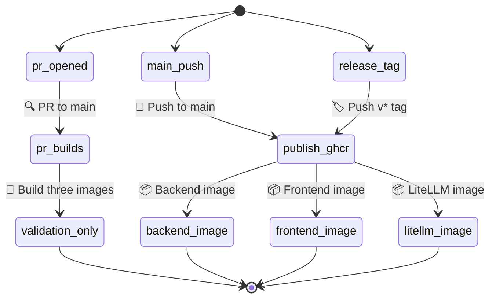

# K-Dense BYOK

**Your own AI research assistant, running on your computer, powered by your API keys.**

K-Dense BYOK (Bring Your Own Keys) is an open-source app that lets you chat with an AI assistant called **Kady**. You ask Kady a question or give it a task, and it figures out the best way to handle it — sometimes answering directly, sometimes spinning up specialized AI "experts" that work behind the scenes to get you a thorough result.

It's built for scientists, analysts, and curious people who want a powerful AI workspace without being locked into a single provider. K-Dense BYOK is powered by our very popular Claude Scientific Skills.

> **Beta:** K-Dense BYOK is currently in beta. Many features and performance improvements are on the way in the coming weeks. [Star us on GitHub](https://github.com/K-Dense-AI/k-dense-byok) to stay in the loop, and follow us on [X](https://x.com/k_dense_ai), [LinkedIn](https://www.linkedin.com/company/k-dense-inc), and [YouTube](https://www.youtube.com/@K-Dense-Inc) for release notes and tutorial videos.

## What can it do?

- **Answer questions and complete tasks** — Ask Kady anything. For complex work, it delegates to AI experts that each have their own specialties (bioinformatics, finance, data analysis, etc.) with full access to our 170+ scientific skills.
- **Search the web** — Kady can look things up online and pull in live information while working on your request.
- **Work with your files** — Upload files, create new ones, and preview them right in the app. Everything stays in a local sandbox folder on your machine. Can handle almost any file type.
- **Access 250+ scientific databases and 500k+ Python packages** — Kady's experts come pre-loaded with specialized scientific skills from [K-Dense](https://github.com/K-Dense-AI), covering everything from genomics to materials science.
- **Choose your AI model** — Pick from 40+ models (OpenAI, Anthropic, Google, xAI, Qwen, and more) through a simple dropdown in the app. You're not stuck with one.

> **Note:** The model you select in the dropdown only applies to Kady (the main agent). Expert execution and coding tasks use the Gemini CLI, which always runs through a Gemini model on OpenRouter regardless of your dropdown selection.
- **Run heavy computations remotely** — Optionally connect [Modal](https://modal.com/) to run demanding workloads on powerful cloud hardware instead of your laptop.

## What you'll need before starting

| What | Why | Where to get it |
|------|-----|-----------------|
| A computer running **macOS or Linux** | The app runs locally on your machine | Windows works too — just use [WSL](https://learn.microsoft.com/en-us/windows/wsl/install) |
| An **OpenRouter API key** | This is how the AI models are accessed | [openrouter.ai](https://openrouter.ai/) — sign up and create a key |
| A **Parallel API key** *(optional)* | Lets Kady search the web | [parallel.ai](https://parallel.ai/) |
| **Modal** credentials *(optional)* | Only needed if you want remote compute for heavy jobs | [modal.com](https://modal.com/) |

That's it. The startup script handles installing everything else automatically.

## Getting started

### Step 1 — Download the project

Open a terminal and run:

```bash
git clone https://github.com/K-Dense-AI/k-dense-byok.git
cd k-dense-byok
```

### Step 2 — Set up your environment variables

The repo now includes a committed root-level [`.env.example`](./.env.example) that defines the canonical deployment contract for:

- the existing **non-Docker** local workflow,
- optional **Docker / Compose** runs, and
- **Dokploy** deployments.

For the current non-Docker startup path, keep using `kady_agent/.env` because `./start.sh` still reads that file directly.

For optional Docker / Compose runs, use the same variable names from `.env.example` in a root `.env` file or pass them from your shell. For Dokploy, define those same variables in the Dokploy UI and make sure the Compose file wires them into each service explicitly.

Create `kady_agent/.env` and copy the values you need from `.env.example`. At minimum, set:

```env
OPENROUTER_API_KEY=your-openrouter-api-key
DEFAULT_AGENT_MODEL=openrouter/google/gemini-3.1-pro-preview
GOOGLE_GEMINI_BASE_URL=http://localhost:4000
GEMINI_API_KEY=sk-litellm-local
```

Optional values for local non-Docker runs:

```env
PARALLEL_API_KEY=your-parallel-api-key
MODAL_TOKEN_ID=your-modal-token-id
MODAL_TOKEN_SECRET=your-modal-token-secret
FRONTEND_PORT=3000
BACKEND_PORT=8000
LITELLM_PORT=4000
```

You do **not** need to set `NEXT_PUBLIC_ADK_API_URL` for the current `./start.sh` workflow unless you want to override the frontend default. The frontend already falls back to `http://localhost:8000` in local development.

If you need different localhost ports for the non-Docker path, export `FRONTEND_PORT`, `BACKEND_PORT`, and/or `LITELLM_PORT` before `./start.sh` (or add them to `kady_agent/.env`). When those vars change, `./start.sh` keeps the same localhost wiring by aligning the frontend URL, backend CORS origin, and LiteLLM base URL to the matching overridden ports unless you explicitly set those URLs yourself.

Without `OPENROUTER_API_KEY`, the app cannot complete model-backed requests correctly.

### Step 3 — Start the app with the supported non-Docker path

```bash
chmod +x start.sh
./start.sh
```

Example with safe local overrides when the defaults are already occupied:

```bash
FRONTEND_PORT=3300 BACKEND_PORT=8100 LITELLM_PORT=4100 ./start.sh
```

The first time you run this, it will automatically install any missing tools (Python packages, Node.js, Gemini CLI) and download scientific skills. This may take a few minutes. After that, future starts will be much faster.

Once everything is running, your browser will open to the configured frontend URL (default **[http://localhost:3000](http://localhost:3000)**) — that's the app.

To stop everything, press **Ctrl+C** in the terminal.

### Step 4 — Optional Docker / Compose local smoke path

Docker and Compose are optional deployment methods. They do not replace `./start.sh`.

1. Copy the deployment contract to a root `.env` file:

   ```bash
   cp .env.example .env
   ```

2. Edit `.env` for your machine. For the default localhost smoke path, set at least:

   ```env
   OPENROUTER_API_KEY=your-openrouter-api-key
   DEFAULT_AGENT_MODEL=openrouter/google/gemini-3.1-pro-preview
   GOOGLE_GEMINI_BASE_URL=http://litellm:4000
   GEMINI_API_KEY=sk-litellm-internal-placeholder
   NEXT_PUBLIC_ADK_API_URL=http://localhost:8000
   BACKEND_CORS_ALLOWED_ORIGINS=http://localhost:3000
   ```

3. Validate the rendered Compose config before starting anything:

   ```bash
   docker compose config
   ```

4. Start the stack:

   ```bash
   docker compose up --build -d
   ```

5. Check service status and smoke-test the exposed endpoints:

   ```bash
   docker compose ps
   curl -f http://127.0.0.1:8000/health
   curl -I http://127.0.0.1:3000
   ```

6. Stop the stack when you are done:

   ```bash
   docker compose down
   ```

If port `3000` or `8000` is already in use on your host, override the host bindings without editing `compose.yml`:

```bash
FRONTEND_HOST_PORT=3300 BACKEND_HOST_PORT=8100 NEXT_PUBLIC_ADK_API_URL=http://localhost:8100 BACKEND_CORS_ALLOWED_ORIGINS=http://localhost:3300 docker compose up --build -d
```

Then smoke-test the overridden ports:

```bash
curl -f http://127.0.0.1:8100/health
curl -I http://127.0.0.1:3300
```

The backend container seeds scientific skills on first boot, so it needs outbound network access and `git` to reach that initial clone step. The persisted sandbox path inside the container remains `/app/sandbox`.

## How it works (the short version)

The app runs three services on your computer:

| Service | What it does |
|---------|-------------|
| **Frontend** (port 3000) | The web interface you interact with — chat, file browser, and file preview side by side |
| **Backend** (port 8000) | The brain — runs Kady and coordinates expert tasks |
| **LiteLLM proxy** (port 4000) | A translator that routes your AI requests to whichever model you've chosen via OpenRouter |

When you send a message, Kady reads it, decides whether to answer directly or delegate to an expert, uses any needed tools (web search, file operations, scientific databases), and streams the response back to you.

## Deployment contract and environment matrix

The canonical topology for this repo is still the same 3-service architecture:

| Service | Canonical name | Port | Exposure |
|---------|----------------|------|----------|
| Frontend | `frontend` | `3000` | Public |
| Backend | `backend` | `8000` | Internal by default, host-bound to `127.0.0.1` for local Compose smoke checks |
| LiteLLM proxy | `litellm` | `4000` | Internal only |

Sandbox state lives under the repo's `sandbox/` directory in the existing non-Docker workflow. Any future container deployment should preserve that same path as the persistence target.

There is currently **no Postgres or Redis** in this repo. The deployment contract for Task 1 only covers the variables already used by the app.

### Environment variable matrix

| Variable | Required | Visibility | Non-Docker `./start.sh` path | Local Compose path | Dokploy path | Notes |
|----------|----------|------------|------------------------------|-------------------|--------------|-------|
| `OPENROUTER_API_KEY` | Yes | Secret | Set in `kady_agent/.env` | Set in root `.env` or exported shell env, injected into `backend` and `litellm` | Secret on `backend` and `litellm` services | Required for model-backed work. `/health` can still return `200` without it, so operators should treat this as required even if the process starts. |
| `DEFAULT_AGENT_MODEL` | Yes | Secret | Set in `kady_agent/.env` | Set in root `.env`, injected into `backend` | Variable or secret on `backend` | Default agent model selection. |
| `GOOGLE_GEMINI_BASE_URL` | Yes | Secret | Usually `http://localhost:4000` in `kady_agent/.env` | Usually `http://litellm:4000` in root `.env`, injected into `backend` | Internal URL on `backend`, typically `http://litellm:4000` | This is backend-to-LiteLLM traffic only. Do not point the browser at LiteLLM. |
| `GEMINI_API_KEY` | Yes | Secret | Usually `sk-litellm-local` in `kady_agent/.env` | Set in root `.env`, injected into `backend` and `litellm` | Secret on `backend` and `litellm` | Internal bearer token used between backend and LiteLLM. This is not a frontend variable. |
| `NEXT_PUBLIC_ADK_API_URL` | Optional for `./start.sh`, required for most non-local deployments | Public, browser-visible | Usually omitted because the frontend falls back to `http://localhost:8000` locally | Set in root `.env`, passed as frontend build arg and runtime env | Public variable on `frontend` | Use the browser-reachable backend URL. For a separate backend domain, set the full public backend URL here. |
| `BACKEND_CORS_ALLOWED_ORIGINS` | Optional for `./start.sh`, required when browser origin is not the default localhost path | Secret runtime config | Usually omitted because backend defaults to `http://localhost:3000` | Set in root `.env`, injected into `backend` | Variable on `backend` | Use real browser origins like `http://localhost:3000` or `https://app.example.com`, not internal DNS names like `frontend`. |
| `PARALLEL_API_KEY` | No | Secret | Optional in `kady_agent/.env` | Optional in root `.env`, injected into `backend` | Optional secret on `backend` | Enables web search integration. |
| `MODAL_TOKEN_ID` | No | Secret | Optional in `kady_agent/.env` | Optional in root `.env`, injected into `backend` | Optional secret on `backend` | Optional Modal integration. |
| `MODAL_TOKEN_SECRET` | No | Secret | Optional in `kady_agent/.env` | Optional in root `.env`, injected into `backend` | Optional secret on `backend` | Optional Modal integration. |

### Supported operator paths

Docker and Compose are **optional deployment paths**. They do **not** replace the existing local startup flow.

1. **Non-Docker path, still supported**
   - Run `./start.sh`.
   - Keep using `kady_agent/.env`.
   - Frontend defaults to `http://localhost:8000` if `NEXT_PUBLIC_ADK_API_URL` is unset.

2. **Optional Docker / Compose path**
   - Use a root `.env` file or exported shell env.
   - `compose.yml` wires variables into containers explicitly through `environment:` and frontend build args.
   - Frontend is public on the configured host port, backend is host-bound for local smoke checks, LiteLLM stays internal-only.

3. **Optional Dokploy path**
   - Keep `frontend` public.
   - Keep `litellm` internal-only.
   - Keep `backend` internal unless you intentionally give the browser a separate public backend URL.
   - If the browser must call a separate backend domain, set `NEXT_PUBLIC_ADK_API_URL` to that public backend URL and include the frontend's real browser origin in `BACKEND_CORS_ALLOWED_ORIGINS`.

4. **Optional prebuilt GitHub Container Registry path**
   - Pull requests to `main` build the three service images in GitHub Actions without publishing them.
   - Pushes to `main` and version tags such as `v0.1.0` publish prebuilt images to GHCR.
   - Image names follow the canonical service split:
     - `ghcr.io/<owner>/k-dense-byok-backend`
     - `ghcr.io/<owner>/k-dense-byok-frontend`
     - `ghcr.io/<owner>/k-dense-byok-litellm`
   - This keeps registry builds PR-gated for validation, while merged code on `main` gets reusable prebuilt images.

For production-style deployments, do not leave localhost assumptions implicit. Set explicit backend and LiteLLM URLs through environment variables so the frontend only reaches the backend's browser-visible URL and backend-to-LiteLLM traffic stays internal.

### Visual deployment overview




### Dokploy wiring notes

Dokploy variables are not injected into containers by magic. Define the variables in the Dokploy UI, then make sure the Compose file references them through `environment:` or variable substitution. This repo already does that for the supported deployment contract.

Recommended Dokploy service expectations:

| Service | Public domain? | Variables to set in Dokploy | Notes |
|---------|----------------|-----------------------------|-------|
| `frontend` | Yes | `NEXT_PUBLIC_ADK_API_URL` | Browser-visible runtime. If frontend and backend do not share one origin, this must be the public backend URL. |
| `backend` | Usually no | `OPENROUTER_API_KEY`, `DEFAULT_AGENT_MODEL`, `GOOGLE_GEMINI_BASE_URL`, `GEMINI_API_KEY`, `BACKEND_CORS_ALLOWED_ORIGINS`, optional `PARALLEL_API_KEY`, optional `MODAL_TOKEN_ID`, optional `MODAL_TOKEN_SECRET` | If you expose the backend on its own domain, add the frontend origin to `BACKEND_CORS_ALLOWED_ORIGINS`. |
| `litellm` | No | `OPENROUTER_API_KEY`, `GEMINI_API_KEY` | Internal service only. Do not assign a public domain. |

### Local Compose verification flow


Use this flow after `docker compose up --build -d`:

1. **Rendered config**

   ```bash
   docker compose config
   ```

2. **Service state**

   ```bash
   docker compose ps
   ```

3. **Backend health**

   ```bash
   curl -f http://127.0.0.1:8000/health
   ```

4. **Frontend HTTP response**

   ```bash
   curl -I http://127.0.0.1:3000
   ```

5. **Sandbox persistence survives backend restart**

   ```bash
   docker compose exec backend python -c "from pathlib import Path; p = Path('/app/sandbox/persistence-check.txt'); p.write_text('compose-persistence-ok\n'); print(p.read_text().strip())"
   docker compose restart backend
   docker compose exec backend python -c "from pathlib import Path; p = Path('/app/sandbox/persistence-check.txt'); print(p.exists(), p.read_text().strip())"
   ```

   Expected result: the second command prints `True compose-persistence-ok`.

6. **Backend-down behavior is visible**

   ```bash
   docker compose stop backend
   curl -I http://127.0.0.1:3000
   curl -f http://127.0.0.1:8000/health
   ```

   Expected result: the frontend can still return an HTTP page while the backend health check fails. API-backed actions in the UI will fail until the backend returns. This is expected and should not be mistaken for full-stack health.

7. **Bring the backend back**

   ```bash
   docker compose start backend
   docker compose ps
   ```

### Out of scope for this deployment path

This repo does not add or document PostgreSQL, Redis, horizontal scaling, or HA behavior. The supported deployment contract is the current 3-service stack plus persistent sandbox storage.

## Project layout

```
k-dense-byok/
├── start.sh              ← The one script that starts everything
├── server.py             ← Backend server
├── kady_agent/           ← Kady's brain: instructions, tools, and config
│   ├── .env              ← Your API keys go here
│   ├── agent.py          ← Main agent definition
│   └── tools/            ← Tools Kady can use (web search, delegation, etc.)
├── web/                  ← Frontend (the UI you see in your browser)
└── sandbox/              ← Workspace for files and expert tasks (created on first run)
```

## Why "BYOK"?

BYOK stands for **Bring Your Own Keys**. Instead of paying a subscription to a single AI company, you plug in API keys from whatever providers you prefer. You stay in control of which models you use, how much you spend, and where your data goes.

## Want more?

K-Dense BYOK is great for getting started, but if you want end-to-end research workflows with managed infrastructure, team collaboration, and no setup required, check out **[K-Dense Web](https://www.k-dense.ai)** — our full platform built for professional and academic research teams.

## Issues, bugs, or feature requests

If you run into a problem or have an idea for something new, please [open a GitHub issue](https://github.com/K-Dense-AI/k-dense-byok/issues). We read every one.

## About K-Dense

K-Dense BYOK is open source because [K-Dense](https://github.com/K-Dense-AI) believes in giving back to the community that makes this kind of work possible.

## Star History

[](https://www.star-history.com/?repos=K-Dense-AI%2Fk-dense-byok&type=date&legend=top-left)
