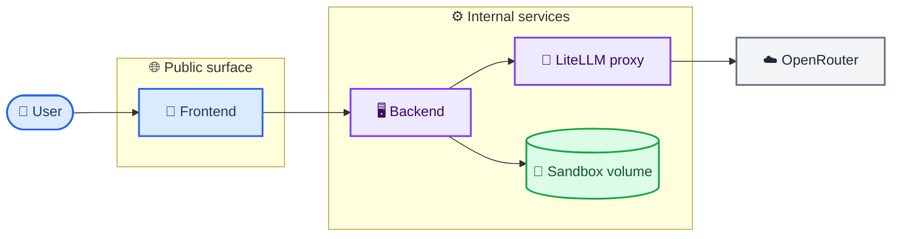
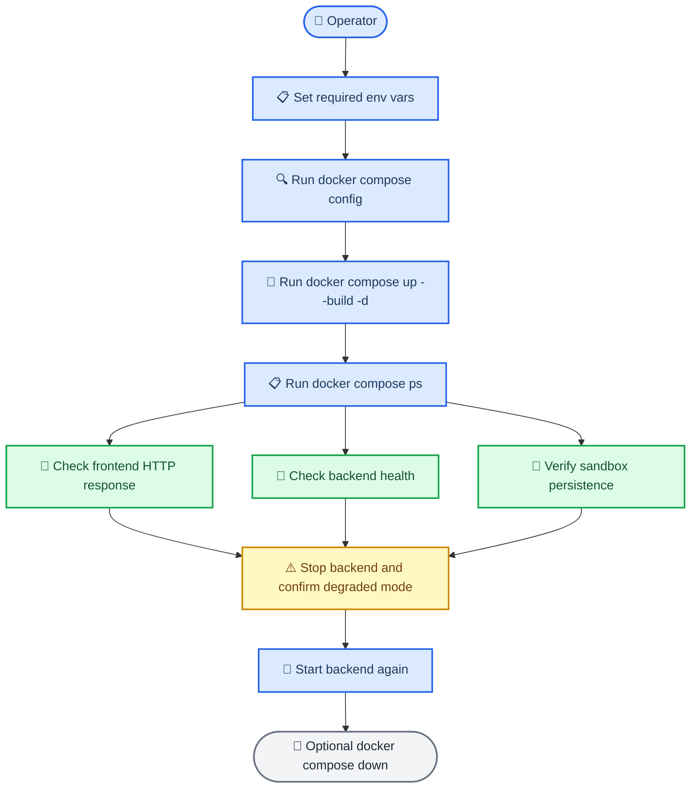
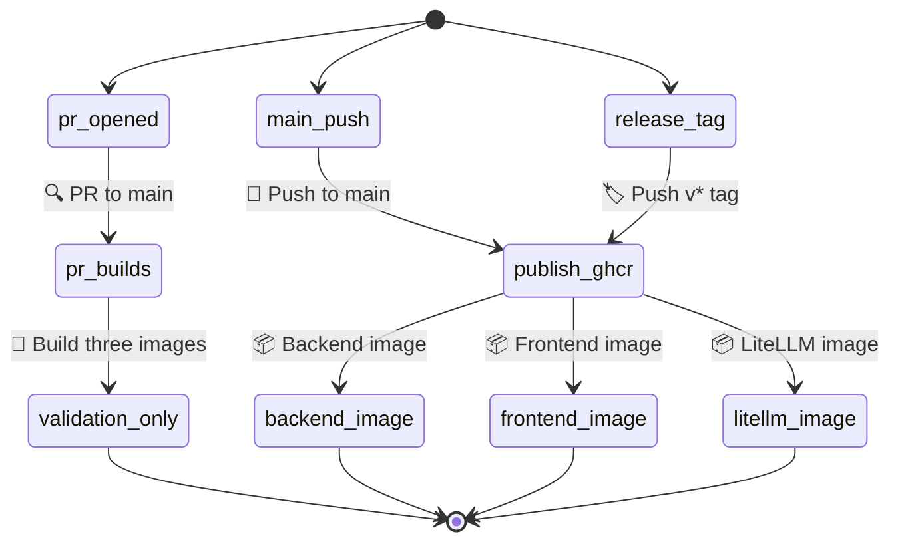

# Docker and Compose deployment guide

This guide covers the optional containerized deployment path for K-Dense BYOK.

If you just want the normal local experience, use `./start.sh` from the main [README](../README.md). Docker and Compose are an additional path for people who want local container runs, VPS/self-hosting, or prebuilt-image deployment.

## Choose a path

- **Default local path:** `./start.sh` using `kady_agent/.env`
- **Docker local-build path:** `docker compose up --build -d`
- **Docker prebuilt-image path:** `docker compose pull` + `docker compose up -d --no-build`

## Environment files

There are two different env-file stories in this repo:

1. **Non-Docker path**
   - Uses `kady_agent/.env`
   - Read directly by `./start.sh`

2. **Docker / Compose path**
   - Uses a root `.env`
   - Best starting point is the root [`.env.example`](../.env.example)

For the Docker path, copy the deployment contract first:

```bash
cp .env.example .env
```

At minimum, set these values in the root `.env`:

```env
OPENROUTER_API_KEY=your-openrouter-api-key
DEFAULT_AGENT_MODEL=openrouter/google/gemini-3.1-pro-preview
GOOGLE_GEMINI_BASE_URL=http://litellm:4000
GEMINI_API_KEY=sk-litellm-internal-placeholder
NEXT_PUBLIC_ADK_API_URL=http://localhost:8000
BACKEND_CORS_ALLOWED_ORIGINS=http://localhost:3000
```

## Option A - Build locally with Docker Compose

Use this path when you want Docker to build the three service images from your local checkout.

```bash
cp .env.example .env
# edit .env with at least OPENROUTER_API_KEY and GEMINI_API_KEY

docker compose config
docker compose up --build -d
docker compose ps
```

Smoke test the default localhost ports:

```bash
curl -f http://127.0.0.1:8000/health
curl -I http://127.0.0.1:3000
```

Stop the stack:

```bash
docker compose down
```

## Option B - Start from prebuilt GHCR images

Use this path when images have already been published and you want Docker to pull and run them without rebuilding locally.

### Upstream default image names

- `ghcr.io/k-dense-ai/k-dense-byok-backend:latest`
- `ghcr.io/k-dense-ai/k-dense-byok-frontend:latest`
- `ghcr.io/k-dense-ai/k-dense-byok-litellm:latest`

### Latest-tag flow

```bash
cp .env.example .env
# edit .env with at least OPENROUTER_API_KEY and GEMINI_API_KEY

docker compose config
docker compose pull
docker compose up -d --no-build
docker compose ps
```

### Pinned-tag flow

```bash
BACKEND_IMAGE=ghcr.io/k-dense-ai/k-dense-byok-backend:v0.2.6 \
FRONTEND_IMAGE=ghcr.io/k-dense-ai/k-dense-byok-frontend:v0.2.6 \
LITELLM_IMAGE=ghcr.io/k-dense-ai/k-dense-byok-litellm:v0.2.6 \
docker compose pull

BACKEND_IMAGE=ghcr.io/k-dense-ai/k-dense-byok-backend:v0.2.6 \
FRONTEND_IMAGE=ghcr.io/k-dense-ai/k-dense-byok-frontend:v0.2.6 \
LITELLM_IMAGE=ghcr.io/k-dense-ai/k-dense-byok-litellm:v0.2.6 \
docker compose up -d --no-build
```

### Fork-based testing or alternate image namespaces

If you are testing from a fork instead of the upstream repo, point Compose at your own image namespace:

```bash
BACKEND_IMAGE=ghcr.io/<your-user>/k-dense-byok-backend:<tag> \
FRONTEND_IMAGE=ghcr.io/<your-user>/k-dense-byok-frontend:<tag> \
LITELLM_IMAGE=ghcr.io/<your-user>/k-dense-byok-litellm:<tag> \
docker compose up -d --no-build
```

## Port overrides

If port `3000` or `8000` is already in use on your host, override the host bindings without editing `compose.yml`:

```bash
FRONTEND_HOST_PORT=3300 \
BACKEND_HOST_PORT=8100 \
NEXT_PUBLIC_ADK_API_URL=http://localhost:8100 \
BACKEND_CORS_ALLOWED_ORIGINS=http://localhost:3300 \
docker compose up --build -d
```

Smoke test the overridden ports:

```bash
curl -f http://127.0.0.1:8100/health
curl -I http://127.0.0.1:3300
```

## Deployment topology



## Local Compose runbook



## GitHub image build lifecycle



## Dokploy note

The Compose and env contract in this branch is compatible with a platform like Dokploy, but this repo does **not** include Dokploy-specific manifests or platform configuration.
