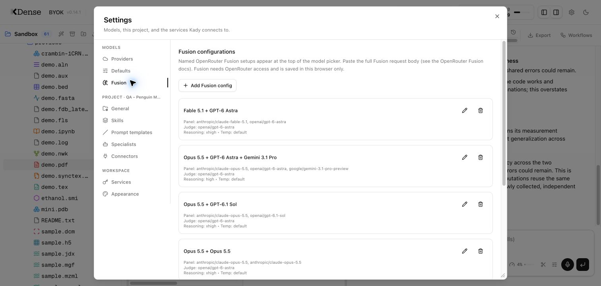
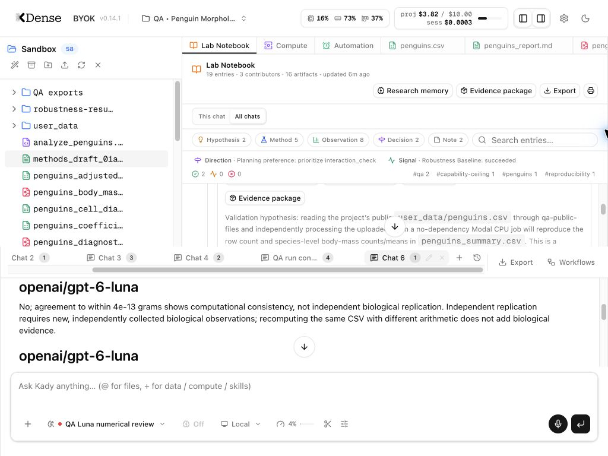

# Chrome research QA — 2026-09-29

Completed a broad, interactive research QA pass on macOS in Google Chrome, against local `main`, app version 0.14.1. Both development and production frontend builds were exercised with the real backend, OpenRouter, an MCP filesystem server and Modal CPU jobs. This is feature-family coverage, not exhaustive testing of every provider, format variant or failure path.

All fixes below are separate commits on local `main`. No release bump or remote push was performed. The QA project and downloaded evidence remain available for inspection.

## Research scenario and evidence

Project: **QA • Penguin Morphology**, ID `qa-penguin-morphology-e9cd08`, $10 spending cap. Public [Palmer Penguins data](https://allisonhorst.github.io/palmerpenguins/articles/download.html) was uploaded through Chrome's native file picker. Small synthetic fixtures covered additional scientific formats. No existing research project was edited.

The main GPT-6 Astra conversation completed a sex-adjusted body-mass analysis, an inline clarification interview, diagnostic plots, tables, scripts and a report. The source contains 344 observations; the fitted model uses 333 complete cases. Its HC3/Holm species contrasts include Gentoo–Adelie ≈1,377.858 g, Gentoo–Chinstrap ≈1,350.934 g, and Chinstrap–Adelie ≈26.924 g, with the last confidence interval crossing zero. The report discusses missingness, observational inference and the common-sex-effect assumption. These outputs exercise the product; they are not an independent scientific certification of the analysis.

The raw CSV remained byte-identical throughout the run:

`e07636bd8af74260099ea2f8678e2eabbf35def579940cc76f67061ee16c06c1`

A delegated statistical reviewer identified independence and species/island confounding limitations. An independent Modal CPU computation matched local nonmissing mass counts (151/68/123) and means (3700.662251655629/3733.0882352941176/5076.016260162602 g). A two-variant durable robustness workflow recomputed those same-data summaries with `math.fsum` and decimal arithmetic: both passed QC, n=344, maximum mean differences 0 and 3.74e-13 g. This is computational agreement on the same observations, not independent biological replication.

Evidence package `ep_28803b3e5ad2417ea37ad5da720641c7` downloaded successfully (735,529 bytes). Its independent `python3 -I verify.py` run exited 0 and verified 35 file hashes. ZIP SHA-256: `6c66841e05697f05d37c38a9eefe97301a1f4277ce9a590d6b82c0ead5b554f0`. The package visibly reports 31 availability/provenance notices; a valid hash manifest does not prove analytical correctness or successful reproduction.

## Chrome coverage

| Area | Real interaction and observed result |
| --- | --- |
| Projects | Created Unicode-named research project, description, tags and budget; edited settings; searched/switched through project directory. Refresh and backend restart retained chats and research files. |
| Defaults | Saved GPT-6 Astra; first chat used it. Production Settings → Defaults still shows GPT-6 Astra, High thinking and Local compute. Additional tabs inherit the selected tab's choices. |
| Providers/services | Inspected connected OpenRouter/NVIDIA, provider search and local-server states; inspected Modal and search-service settings. Existing credentials were retained. |
| Project controls | Saved general settings/tags; inspected instructions; enabled raw-data guard; exercised context settings. Lowering the cap below spending blocked new paid runs and showed the settings link; restoring $10 cleared the block. |
| Chat/tool execution | Completed genuine Astra and Luna runs with streamed reasoning, tool cards, file creation and final answers. Inline interview survived refresh and accepted answers. Relative report/figure links open the project preview after the fix. |
| Multi-tab/history | Reached 10 tabs and verified the new-tab limit; separate drafts survived reload, including tabs 7 and 10. Closed spare tabs, renamed a tab, reopened history and exported a conversation. |
| Run controls | Tested Stop during a deliberate 30-second local wait. Queued follow-up returned to the composer after interruption and was subsequently sent. Steering was submitted, but precise mid-tool timing was not independently established. |
| Context compaction | Manual compaction in the large research chat succeeded, reducing reported context from 143,424 to about 91,089 tokens and adding the history divider. A small chat correctly reported nothing to compact. |
| Skills | Created and edited a project QA skill, toggled enablement and model invocation, invoked `/skill:qa-penguin-audit`; manual-only skills disappear from the pinned picker. Global skills were not mutated. |
| Prompt templates | Created `/qa-summary` and invoked it on the report; arguments expanded and the result rendered. History/fleet labels now show the command rather than raw expanded XML. |
| Specialists/fleet | Edited a scientific specialist's thinking setting, launched one real review, inspected fleet and transcript. Child completion, model usage and findings appeared. |
| MCP | Added the official filesystem MCP against the disposable fixture folder, connected 14 tools, and read the public CSV through the connector. |
| Web access | A real research turn searched/fetched the official Palmer Penguins documentation through the available fallback path. |
| Fusion | Invalid JSON displayed validation. Created and ran a custom two-Luna panel; refreshed all six built-ins and retained the custom config. Updated Opus 5.5 + GPT-6.1 Sol with Astra judge completed in Chrome. |
| Watchdog | Enabled a bounded Luna reviewer. Found/fixed ignored-sandbox edit detection. After restart, a real file write triggered warning cards and metered review receipts. Reviewer false positives caused a correction loop; Stop ended it. Restored disabled/inherited model settings and closed the QA review tab. |
| Notebook | Added a note, comment and pin; switched All chats/This chat; followed artifacts; inspected file provenance/environment and searched research memory (8 hits). Fixed duplicate divider keys for interleaved sessions. |
| Research planning | Froze a hypothesis and plan revision with file hashes; generated two next-step proposals after a stale-source refresh; recorded preference/safeguard acknowledgements without running the proposal. |
| Methods/evidence | Generated a Methods draft while retaining the review dialog after the fix; exported notebook/evidence ZIPs; independently verified evidence-package hashes. |
| Workflows | Selected public CSV in Explore My Data, customized the prompt, and completed a bounded data summary. Approved and ran the two-variant robustness workflow, inspected results/QC, and downloaded JSON plus Markdown summaries. |
| Schedules | Created a paused 24-hour check; manually ran it to completion. Fixed policy-ceiling persistence and model override persistence. A second paused schedule retained its exact Luna model on disk. Both remain paused. |
| Modal | Completed an actual CPU summary, collected its JSON artifact and provenance, ran two robustness jobs, and cancelled a separate sleeping CPU job. Cancellation ended with no reservation left. No GPU was provisioned. |
| Files | Uploaded files and a directory with native Chrome picker; created a folder; edited/saved Markdown, renamed it and downloaded the result. Inspected producing/move steps in provenance. |
| Images | Pasted an inline PNG; the model correctly identified grams/Gentoo and did not infer an unavailable exclusion reason. Drew an image annotation, undid it and cancelled; original image unchanged. Saving image annotations was not exercised. |
| PDF/LaTeX | Compiled a LaTeX fixture and opened its PDF. Saved a user note and added an agent note through its tool. Both persisted after production reload; toggling expert annotations changed the visible count 2→1→2. SyncTeX control was exercised, without a precise source-coordinate assertion. |
| Appearance/layout | Toggled dark/light and restored light. Fixed unusable panes at narrower desktop/tablet sizes; verified 1024×768 and 768×900. A 390px window had no outer overflow but remains cramped; not a full mobile usability certification. |
| Production smoke | Built Next.js, started the production frontend, reopened the QA project, continued a real agent run, restored PDF annotations, and verified saved defaults/Fusion settings. No new warning/error console entries in the final production observation window. |

## Scientific previews and bounded stress

| Family | Chrome verification |
| --- | --- |
| Tables | Penguins CSV pagination and search; a 1.4 MB, 50,000-row synthetic CSV loads, page 2 works, and full-file search finds `last_sample` at row 49,999. The new server limit is 8,000,000 bytes for CSV, with explicit over-limit behavior tested. |
| Structural biology | Public crambin PDB: 327 atoms, one chain, 1.5 Å metadata; rendered and rotated in 3D. |
| Chemistry | Ethanol SMILES: C2H6O, 46.069 molecular mass, 3 atoms/2 bonds. |
| Mass spectrometry | MGF two-spectrum selection (445.12→560.3), mzML four spectra/TIC, mzXML two spectra/TIC. |
| Spectroscopy | JCAMP IR spectrum renders. |
| Arrays | HDF5 2×3 int64; NPY 3×4 with range 0–11 and mean 5.5; NPZ array selection; NetCDF coordinates/data. |
| Columnar data | Parquet three rows/two columns. |
| Imaging | Synthetic DICOM 128px CT; NIfTI 4×5×6 with axis and slice changes; TIFF frame selection on a three-frame stack. |
| Single-cell | Synthetic AnnData 120 cells ×30 genes; UMAP colored by cell type (three groups of 40). |
| Sequences/genomics | FASTA two sequences and GC summary; two-sequence alignment; Newick three-leaf tree; BED two features. |
| Notebooks/text | Jupyter two cells including rendered output 4; Markdown/report links; editable plain text and LaTeX. |

Stress was bounded to 10 chat tabs, long research context, 50,000 table rows, many open preview tabs, two simultaneous CPU variants, cancellation and reload/restart recovery. This was not a sustained load benchmark or a concurrency test of ten simultaneous paid model runs.

## Fusion refresh

The six built-in panels now use:

1. Fable 5.1 + GPT-6 Astra.
2. Opus 5.5 + GPT-6 Astra + Gemini 3.1 Pro.
3. Opus 5.5 + GPT-6.1 Sol.
4. Two Opus 5.5 calls.
5. Exaflop: GPT-6 Astra Pro + Gemini 3.1 Pro + Fable 5.1.
6. Gemini 3.8 Flash + Kimi K3 + DeepSeek V4.1 Flash.

All use GPT-6 Astra as judge. IDs, supported reasoning levels and prices were checked against the [live OpenRouter model catalog](https://openrouter.ai/api/v1/models) on 2026-09-29. Gemini 3.1 Pro remains the listed Pro model. Opus 5.5 returned HTTP 400 as judge in these tests while the identical panel succeeded with Astra; this is an observed compatibility limitation, not a claim that Opus fails as a panel member.

Defaults version 5 migrates unchanged shipped presets while retaining custom and edited configurations. Old benchmark claims were removed because these combinations have not been benchmarked. All six configurations passed catalog/pricing checks; the Opus/Sol panel and the custom Luna panel received full live completion tests, not all six expensive presets.

## Commits

| Commit | Change |
| --- | --- |
| `bf574d7` | Default new chats to GPT-6 Astra. |
| `a5ba795` | Correct instructions for editing project guidance. |
| `df06c1a` | Use canonical sandbox path normalization for Modal transfers. |
| `11af570` | Open relative Markdown artifact links/images in the project workspace. |
| `aa39e6a` | Support bounded multi-megabyte CSV previews. |
| `1abce8e` | Persist durable schedules under the host capability policy and intersect saved/current restrictions at execution. |
| `e334d7a` | Keep the review context when a Methods draft finishes; provide an explicit Open draft action. |
| `9e927e2` | Give interleaved notebook chat dividers unique keys. |
| `7e103af` | Stop implying interrupted runs completed successfully. |
| `b75e1b1` | Preserve scheduled model overrides when saving and restoring schedules. |
| `2465492` | Correct the Methods toast test's TypeScript narrowing. |
| `6804321` | Keep research panes usable at smaller window sizes. |
| `dbe2883` | Refresh Fusion models and safely migrate saved presets. |
| `ed21f01` | Render command names in history/fleet previews instead of expanded XML. |
| `173c1cc` | Scope Watchdog Git inspection to the project and restore observed-edit reviews for ignored sandboxes. |

## Automated verification

- Backend full suite after the Watchdog fix: **1,272 passed, 1 skipped**, 117 passing test files and 1 skipped file.
- Frontend full suite: **752 passed**, 113 test files.
- Watchdog targeted regression/settings suite: **10 passed**, including ignored parent checkout, observed-write review, project Git root and unchanged standalone Pi behavior.
- Backend and frontend TypeScript checks: passed.
- Next.js production build: passed; production Chrome smoke described above.
- Initial backend Modal path-conformance failure was fixed. An initial frontend workflow timeout under concurrent load passed on targeted rerun and in the final full suite.

## Cost, final state and limits

The app displayed approximately **$3.88** of the $10 project cap at the end. Two direct OpenRouter diagnostic completions outside the app ledger added approximately **$0.0332**. These are observed/estimated usage figures, not a provider invoice. Failed Fusion judge requests reported no usage. Modal jobs finished or were cancelled, reservations cleared, both schedules are paused, and Watchdog is disabled. The QA data and artifacts are retained; the default is Astra and the refreshed Fusion presets are saved in Chrome.

Untested or partial: OAuth sign-in/account creation, new secret entry, disconnected local model servers, every direct provider and model, microphone/dictation, GPU execution, destructive purge/removal flows, every workflow/template and format variant, child Watchdog reviews, fleet stop/resume of a long-running specialist, mission authoring, image-annotation save, precise SyncTeX mapping, scheduled firing after 24 hours, and Windows/Linux runtime behavior. No claims of exhaustive feature-path coverage are made.

Watchdog is advisory: the live low-cost reviewer generated false positives and repeated requests despite an existing write/read record. It can be stopped and remains off by default. The sandbox detection fix ensures review happens; it does not establish review accuracy. Without a project Git root, opaque shell-only file changes need a configured tool cadence for reliable review opportunities. Evidence verification establishes package integrity, not biological replication or analytical validity.
